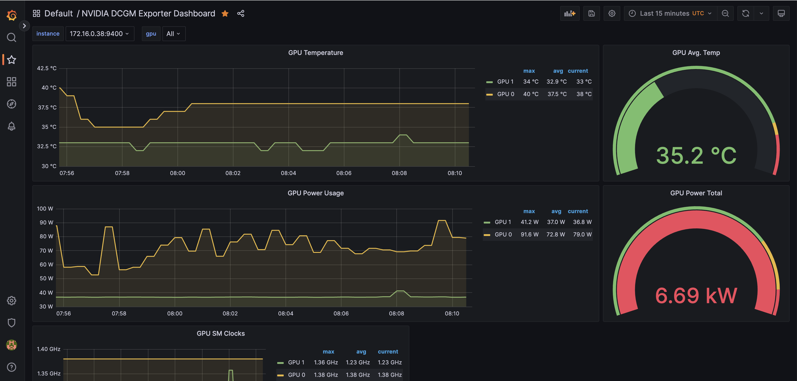

# Tutorial for Demo for Open Source Summit NA 2023
### Title: [5 Steps to Deploy Cloud Native Sustainable Foundation AI Models](https://docs.google.com/presentation/d/187KrP5JIh6m9-5nD-pIiHkv7Tl0xznBg/edit?usp=sharing&ouid=108627907206289814808&rtpof=true&sd=true)
#### Speakers: Chen Wang, IBM & Huamin Chen, Red Hat
The repo contains Kubernetes deployment files and documentations to deploy cloud native foundational model systems, including
[BLOOM Inference server](https://github.com/huggingface/transformers-bloom-inference ) and 
[Stable-Diffusion Web UI](https://github.com/AbdBarho/stable-diffusion-webui-docker ), and evaluate energy consumptions.

## Prerequisites
1. Kubernetes v1.27 Clusters on GPU servers with root access to GPU nodes.
2. [NVidia GPU Driver](https://docs.nvidia.com/cuda/cuda-installation-guide-linux/) installed
3. [Nvidia GPU Operator](https://docs.nvidia.com/datacenter/cloud-native/gpu-operator/getting-started.html#operator-install-guide) installed
4. [kube-prometheus](https://github.com/prometheus-operator/kube-prometheus) deployed.
5. [Nvidia DCGM-exporter](https://github.com/NVIDIA/dcgm-exporter) deployed.
6. kubectl access to the clusters on the load-testing server.
7. [Python 3.9]() installed on load testing server.

## Steps
### Step 1: Containerize FM model servers
1. We leverage two existing open sourced foundation AI model servers for deployment. 

- One is [BLOOM Inference server](https://github.com/huggingface/transformers-bloom-inference)
that is developed by [BigScience Workshop](https://huggingface.co/bigscience). BLOOM is a Large Open-science Open-access Multilingual Language Model.
The architecture of BLOOM is essentially similar to GPT3 (auto-regressive model for next token prediction).
BLOOM has been trained on 46 different languages and 13 programming languages.
- The second one is [Stable Diffusion Server](https://github.com/CompVis/stable-diffusion) that is developed by 
[Ommer-Lab](https://ommer-lab.com/research/latent-diffusion-models/). Stable Diffusion is a latent text-to-image diffusion model 
trained on 512x512 images from a subset of the LAION-5B database. It can be used to generate images from text prompts.

2. Build container image for BLOOM inference server.
a) Clone the open source BLOOM inference server code.
```bash
> git clone https://github.com/huggingface/transformers-bloom-inference
> cd transformers-bloom-inference
```
b) Build your own docker image for the bloom inference server and push to your own image repo. Replace <img_repo> to your own repo.
```bash
> docker build -f Dockerfile -t <img_repo>/bloom:latest .
> docker push <img_repo>/bloom:latest
```

3. Build container image for Stable-Diffusion server.
a) Similarly, we clone the open sourced docker version of Stable diffusion server.
```bash
> git clone https://github.com/AbdBarho/stable-diffusion-webui-docker.git
```

b) Modify the provided [Dockerfile](https://github.com/AbdBarho/stable-diffusion-webui-docker/blob/master/services/AUTOMATIC1111/Dockerfile) 
to enable the API calls for the stable diffusion server.
```bash
> cd stable-diffusion-webui-docker
> vi services/AUTOMATIC1111/Dockerfile
```
Add ENV variable `COMMANDLINE_ARGS=--api` to enable api serving and also modify the `CMD` to enable APIs.
``` Dockerfile
ENV COMMANDLINE_ARGS=--api
EXPOSE 7860
ENTRYPOINT ["/docker/entrypoint.sh"]
CMD python -u webui.py --listen --port 7860 ${CLI_ARGS} ${COMMANDLINE_ARGS}
```

c) Build and push you own stable diffusion server image. Replace <img_repo> to your own repo.
```bash
> docker build -f Dockerfile -t <img_repo>/stable-diffusion:latest .
> docker push <img_repo>/stable-diffusion-web-ui-api:latest
```

### Step 2: Deploy FM servers on Kubernetes
1. Clone [this repo](https://github.com/wangchen615/OSSNA23Demo.git).
```bash
> git clone https://github.com/wangchen615/OSSNA23Demo.git
> cd OSSNA23Demo
```
2. Deploy the manifests for both BLOOM and Stable Diffusion servers and allocate 1 GPU per each server.
```bash
> kubectl create -f manifests/bloom-server.yaml
> kubectl create -f manifests/stable-diffusion.yaml
```
3. Forward the ports to localhosts of load-testing server for both FM services, prometheus endpoint and grafana for 
load testing purposes and detach the screen using `^+A+D`.
a) BLOOM Server
```bash
> screen -S bloom-server
> kubectl port-forward svc/bloom-service 5001
```
b) Stable diffusion server
```bash
> screen -S stable-diffusion
> kubectl port-forward svc/stable-diffusion 7860
```
c) Prometheus endpoint
```bash
> screen -S prometheus
> kubectl --namespace monitoring port-forward svc/prometheus-k8s 9090
```
d) Grafana endpoint
```bash
> screen -S grafana
> kubectl --namespace monitoring port-forward svc/grafana 3000
```

### Step 3: Run testing load and Observe Energy Consumptions
1. Import [Nvidia DCGM exporter dashboard](https://grafana.com/grafana/dashboards/12239-nvidia-dcgm-exporter-dashboard/) to the grafana dashboard.
2. Open FM service UIs for image or text generation.
a) On the load-testing server, open http://localhost:5001 in your browser to try BLOOM query generation. Try the following query.
```text
Hello, welcome to Open Source Summit 2023 in Vancouver.
```


b) On the load-testing server, open http://localhost:7860 in your browser to try stable diffusion image generation. Try the following query.
```text
"a beautiful matte painting of glass forest, m. c. escher and gustave dore and sam spratt, cinematic, dynamic lighting, concept art, realistic, realism, colorful"
```


3. Run FM load generator scripts to generate load on both FM services.
a) Enable Python virtual environment for load-testing purposes.
```bash
> cd OSSNA23Demo
> python -m venv /path/to/new/virtual/bloom-load-generator
> source /path/to/new/virtual/bloom-load-generator/bin/activate
> pip install -r requirements.txt
```
b) Run load-testing script for stable-diffusion queries.
```bash
> screen -S stable-diffusion-load
> python3 stablediffusion-generate-query.py --host localhost --port 7860 --exp-name "oss-demo-SD" --metric-endpoint http://localhost:9090 --num-tests 20
```
Run load-testing script for BLOOM queries.
```bash
> screen -S bloom-load
> python3 bloom-generate-fixed-token-query.py --host localhost --port 5001 --exp-name "oss-demo-bloom" --metric-endpoint http://localhost:9090 --num-tests 20
```

c) Observe the GPU energy consumption, GPU temperature, GPU frequency changes on 


### Step 4: Tune Nvidia GPU energy conservation knobs to observe the power consumption changes.
1. Tune Nvidia GPU power capping
a) Show the effective range of GPU power capping
```bash
nvidia-smi -q -d POWER
```
b) Configure GPU power capping for stable diffusion GPU. Find the stable diffusion GPU ID.
```bash
> sudo nvidia-smi -i GPU_ID -pl NEW_POWER_LIMIT
```
2. Tune Nvidia GPU graphics CLOCK frequencies.
a) Show the possible frequency setting for GPU graphics and memory.
```bash
nvidia-smi -q -d SUPPORTED_CLOCKS
```
b) Change the frequency setting for bloom server GPU.
```bash
nvidia-smi -i GPU_ID -ac MEMORY_CLOCK,GRAPHICS_CLOCK
```

### Step 5: Observe the performance and GPU energy consumption changes before and after tuning.


### References
1. BLOOM prompts are generated from [reddit dataset](https://github.com/minimaxir/textgenrnn/blob/master/datasets/reddit_rarepuppers_politics_2000_context.csv).
2. Stable diffusion prompts are from [Gustavosta/Stable-Diffusion-Prompts](https://huggingface.co/datasets/Gustavosta/Stable-Diffusion-Prompts)